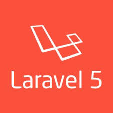

<h2 align="center">BAB II    LANDASAN TEORI </h2>
<strong>2.1	Pengertian Rancang Bangun</strong>

Menurut Hasan Alvin (2006:14), Rancang bangun adalah suatu istilah umum untuk membuat atau mendesain suatu objek dari awal pembuatan sampai akhir pembuatan.
 
Rancang bangun berawal dari kata desain yang artinya perancangan, rancang, desain, bangun. Sedangkan merancang sendiri berarti mengatur, mengerjakan atau melakukan sesuatu dan perancangan artinya proses, cara, perbuatan merancang. Jadi, dapat disimpulkan arti kata desain adalah proses, cara, perbuatan dengan mengatur segala sesuatu sebelum bertindak atau merancang.
 
Dari kedua pengertian diatas dapat kita simpulkan bahwa rancang bangun adalah tahapan-tahapan untuk menghasilkan sebuah hasil yang diinginkan dengan cara membuat atau mendesain objek yang diinginkan melalui beberapa proses.

 
<strong>2.2	Pengertian Mini Bank</strong>

Menurut Jerry M. Rosenberg (1982:44) didalam bukunya “Dictionary of Banking and “ mengenai pengertian bank adalah “Bank is an organization atau bank adalah suatu badan atau organisasi, biasanya dalam bentuk perusahaan dan bekerjasama atau disewa dengan pemerintah, untuk melakukan penerimaan deposito dan giro yang berjangka”. Sedangkan Mini Bank itu sendiri berarti mencakup ruang lingkup yang lebih kecil dibandingkan Bank pada umumnya.

 
<strong>2.3	Pengertian Siswa</strong>

Siswa merupakan pelajar yang duduk dimeja belajar setrata sekolah dasar maupun menengah pertama (SMP), sekolah menengah keatas (SMA). Siswa-siswa tersebut belajar untuk mendapatkan ilmu pengetahuan dan untuk mencapai pemahaman ilmu yang telah didapat dunia pendidikan. Siswa atau pesetra didik adalah mereka yang secara khusus diserahkan oleh kedua orang tuanya untuk mengikuti pembelajaran yang diselengarakan di sekolah, dengan tujuan untuk menjadi manusia yang berilmu pengetahuan, berketrampilan, berpengalaman, berkepribadian, berakhlak mulia, dan mandiri.

 
<strong>2.4	Pengertian Sistem</strong>

Sistem merupakan suatu kerangka dari prosedur-prosedur yang saling berhubungan, yang kemudian disusun sesuai dengan skema yang menyeluruh untuk melaksanakan suatu kegiatan atau fungsi utama dari perusahaan yang dihasilkan oleh suatu proses tertentu yang bertujuan untuk menyediakan informasi untuk membantu mengambil keputusan manajemen operasi perusahaan, serta menyediakan informasi yang layak untuk pihak di luar perusahaan.

 
<strong>2.5	Pengertian Informasi</strong>

Informasi merupakan hal yang sangat penting bagi perusahaan dalam pengambilan keputusan sehari-hari. 
 
Beberapa ahli mendefinisikan informasi sebagai berikut: 
 
Menurut Agus Mulyanto (2009 : 12) dalam bukunya yang berjudul Sistem 
Informasi Konsep dan Aplikasi:  
 
“ Informasi adalah data yang diolah menjadi bentuk yang lebih berguna dan lebih berarti bagi yang menerimanya, sedangkan data merupakan sumber informasi yang menggambarkan suatu kejadian yang nyata ”. 
 
Menurut Jogiyanto (2009 : 8) dalam bukunya yang berjudul Analisis dan 
Desain Sistem Informasi mengemukakan definisi informasi adalah : 
 
“Data yang diolah menjadi bentuk yang lebih berguna dan lebih berarti bagi yang menerimanya“. 

 
<strong>2.6	Pengertian Sistem Informasi</strong>

Menyangkut pemahaman tentang pengertian sistem informasi ini, dalam bukunya Agus Mulyanto (2009:29) dalam bukunya yang berjudul Sistem Informasi Konsep dan Aplikasi mengutipkan beberapa pendapat para ahli, diantaranya: 
 
1.	Menurut James alter, sistem informasi adalah “Kombinasi antar prosedur kerja, informasi, orang dan teknologi informasi yang diorganisasikan untuk mencapai tujuan dalam sebuah organisasi”. 
 
2.	Menurut Bodnar dan Hopwood, sistem informasi adalah “Kumpulan perangkat keras dan perangkat lunak yang dirancang untuk mentransformasikan data ke dalam bentuk informasi yang berguna”. 

 
<strong>2.7	Pengertian Tabungan</strong>

Menurut UU Perbankan No.10 Tahun 1998 tabungan adalah simpanan yang pada penarikannya hanya dapat dilakukan menurut syarat tertentu yang telah disepakati, namun tidak dapat ditarik dengan cek, bilyet giro atau alat lainnya yang dipersamakan dengan itu.
Tabungan merupakan media penyimpanan uang yang sangat disukai oleh seluruh lapisan masyarakat.

 
<strong>2.8	Pengertian Akuntansi</strong>

Akuntansi adalah suatu proses pencatatan, pengklasifikasian/penggolongan, pelaporan serta peng-analisa-an data keuangan suatu entitas/organisasi. Definisi ini menunjukkan kegiatan akuntansi adalah tugas yang kompleks, yang meliputi berbagai macam kegiatan. Basically, akuntansi harusnya:
 
1.	Mengidentifikasi data yang berhubungan atau relevan dengan keputusan jang akan diambil.
 
2.	Memproses dan atau menganalisa data-data yang relevan.
 
3.	Mengolah data menjadi suatu informasi handal yang bisa digunakan untuk pengmbilan keputusan.

 
<strong>2.9	SMK Negeri 1 Sipirok</strong>

    
     
    Gambar 2.1 SMK Negeri 1 Sipirok

SMK Negeri 1 Sipirok terletak di didesa Padang Bujur Kecamatan Sipirok Kabupaten Tapanuli Selatan Sumatera Utara.

 
<strong>2.10	Framework Laravel 5</strong>

    
     
    Gambar 2.2 Laravel 5

Laravel adalah sebuah framework PHP yang dirilis dibawah lisensi MIT, dibangun dengan konsep MVC (model view controller). Laravel adalah pengembangan website berbasis MVC yang ditulis dalam PHP yang dirancang untuk meningkatkan kualitas perangkat lunak dengan mengurangi biaya pengembangan awal dan biaya pemeliharaan, dan untuk meningkatkan pengalaman bekerja dengan aplikasi dengan menyediakan sintaks yang ekspresif, jelas dan menghemat waktu.
 
MVC adalah sebuah pendekatan perangkat lunak yang memisahkan aplikasi logika dari presentasi. MVC memisahkan aplikasi berdasarkan komponen- komponen aplikasi, seperti : manipulasi data, controller, dan user interface.

 
<strong>2.11	Pengertian Pengarsipan Data</strong>

Arsip secara etimologi berasal dari bahasa Latin, yaitu Felum (bundel) yang artinya tali atau benang. Bahasa Yunani, yaitu Archium artinya peti untuk menyimpan sesuatu. Bahasa Inggris, yaitu Archieve artinya kumpulan warkat; “record” artinya catatan; “file” artinya sekumpulan informasi. Bahasa Belanda, yaitu Achief artinya warkat dan bahasa Jerman, yaitu archivalen artinya warkat. Jadi arsip adalah warkat atau catatan mengenai peristiwa atau hal. Sementara kearsipan adalah suatu proses mulai dari penciptaan, penerimaan, pengumpulan, pengaturan, pengendalian, pemeliharaan dan perawatan serta penyiapan warkat menurut sistem tertentu.

 
<strong>2.12	Basisdata (Database)</strong>

Basis Data terdiri atas 2 kata, yaitu Basis dan Data. Basis adalah markas atau gudang, tempat bersarang/berkumpul.Sedangkan Data adalah representasi fakta dunia nyata yang mewakili suatu objek seperti manusia (pegawai, siswa, pembeli, pelanggan), barang, hewan, peristiwa konsep. Jadi, Basis Data adalah Himpunan kelompok data (arsip) yang saling berhubungan yang diorganisasikan sedemikian rupa agar kelak dapat dimamfaatkan kembali dengan cepat dan mudah.

 
<strong>2.13	MySQL</strong>

MySQL merupakan software system manajemen database (DBMS) yang sangat popular dikalangan pemrogram web, terutama di lingkungan  Linux dengan menggunakan  script PHP danperl. MySQL juga dipergunakan untuk membangun aplikasi web yang menggunakan database sebagai sumber dan pengelola datanya. 
 
MySQL mudah popular karena kemudahannya untuk digunakan, cepat secara kinerja query. Situs-situs terkemuka di internet juga banyak yang menggunakan MySQL untuk menyimpa ndatanya. MySQL dikenal sebagai database yang pertama kali didukung oleh bahasa pemrograman script untuk internet – PHP dan perl. MySQL dan PHP dianggap sebagai pasangan software pengembangan aplikasi berbasis web yang ideal.

 
<strong>2.14	UML (Unified Modeling Language) </strong>

UML (Unified Modeling Language) adalah ‘bahasa’ pemodelan untuk sistem atau perangkat lunak yang berparadigma ‘berorientasi objek”. Pemodelan (modeling) sesungguhnya digunakan untuk penyederhanaan permasalahan-permasalahan yang kompleks sedemikian rupa sehingga lebih mudah dipelajari dan dipahami.

